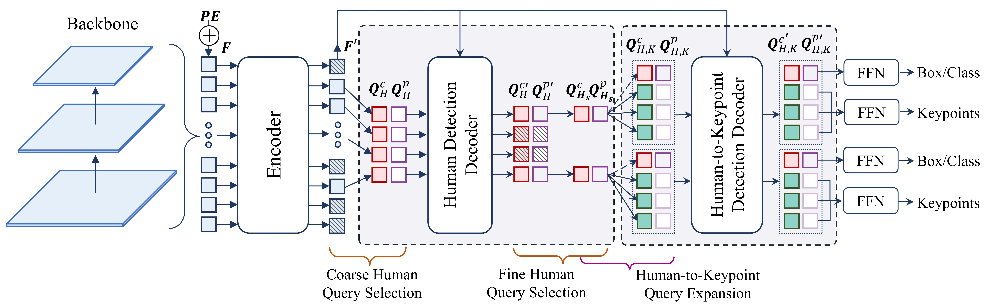

# ED-Pose

This is the official pytorch implementation of our ICLR 2023 paper ["Explicit Box Detection Unifies End-to-End Multi-Person Pose Estimation "](https://openreview.net/pdf?id=s4WVupnJjmX). 

Authors: Jie Yang, Ailing Zeng, Shilong Liu, Feng Li, Ruimao Zhang, Lei Zhang
# Introduction
We present ED-Pose, an end-to-end framework with Explicit box Detection for multi-person Pose estimation. ED-Pose re-considers this task as two explicit box detection processes with a unified representation and regression supervision.
In general, ED-Pose is conceptually simple without post-processing and dense heatmap supervision.
1. For the first time, ED-Pose, as a fully end-to-end framework with a L1 regression loss, surpasses heatmap-based Top-down methods under the same backbone by 1.2 AP on COCO.
2. ED-Pose achieves the state-of-the-art with 76.6 AP on CrowdPose without test-time augmentation.
# Methods


## Model Zoo
We have put our model checkpoints here.

### Results on COCO val2017 dataset

|  Model  |   Backbone    | Lr schd | mAP  | AP<sup>50</sup> | AP<sup>75</sup> | AP<sup>M</sup> | AP<sup>L</sup> |                                             Download                                              |
|:-------:|:-------------:|:-------:|:----:|:---------------:|:---------------:|:--------------:|:--------------:|:-------------------------------------------------------------------------------------------------:|
| ED-Pose |     R-50      |   60e   | 71.7 |      89.7       |      78.8       |      66.2      |      79.7      |                                           Google Drive                                            |
|  ED-Pose   |    Swin-L     |  60e   | 74.3 |      91.5       |      81.7       |      68.5      |      82.7      |                                           Google Drive                                            |
|  ED-Pose   | Swin-L-5scale |  60e   | 75.8 |      92.3       |      82.9       |      70.4      |      83.5      | Google Drive |

### Results on CrowdPose test dataset

| Model | Backbone | Lr schd | mAP  | AP<sup>50</sup> | AP<sup>75</sup> | AP<sup>E</sup> | AP<sup>M</sup> | AP<sup>H</sup> |                                             Download                                              |
|:-----:|:--------:|:-------:|:----:|:---------------:|:---------------:|:--------------:|:--------------:|:--------------:|:-------------------------------------------------------------------------------------------------:|
| ED-Pose  |  R-50  |   80e   | 69.9 |      88.6       |      75.8       |      77.7      |      70.6      |      60.9      |                                           Google Drive                                            |
| ED-Pose  |  Swin-L  |  80e   | 73.1 |      90.5       |      79.8       |      80.5      |      73.8      |      63.8      |                                           Google Drive                                            |
| ED-Pose  |  Swin-L-5scale  |  80e   | 76.6 |      92.4       |      83.3       |      83.0      |      77.3      |      68.3      | Google Drive |

### Note:
- Any test-time augmentations is not used.
- We use the Object365 dataset to pretrain the human detection of ED-Pose under the Swin-L-5scale setting.

## Environment Setup 

<details>
  <summary>Installation</summary>
  
  We use the [DN-Deformable-DETR](https://arxiv.org/abs/2203.01305) as our codebase. We test our models under ```python=3.7.3,pytorch=1.9.0,cuda=11.1```. Other versions might be available as well.

   1. Clone this repo
   ```sh
   git clone https://github.com/IDEA-Research/ED-Pose.git
   cd ED-Pose
   ```

   2. Install Pytorch and torchvision

   Follow the instruction on https://pytorch.org/get-started/locally/.
   ```sh
   # an example:
   conda install -c pytorch pytorch torchvision
   ```

   3. Install other needed packages
   ```sh
   pip install -r requirements.txt
   ```

   4. Compiling CUDA operators
   ```sh
   cd models/edpose/ops
   python setup.py build install
   # unit test (should see all checking is True)
   python test.py
   cd ../../..
   ```
</details>

<details>
  <summary>Data Preparation</summary>

**For COCO data**, please download from [COCO download](http://cocodataset.org/#download). 
The coco_dir should look like this:
```
|-- EDPose
`-- |-- coco_dir
    `-- |-- annotations
        |   |-- person_keypoints_train2017.json
        |   `-- person_keypoints_val2017.json
        `-- images
            |-- train2017
            |   |-- 000000000009.jpg
            |   |-- 000000000025.jpg
            |   |-- 000000000030.jpg
            |   |-- ... 
            `-- val2017
                |-- 000000000139.jpg
                |-- 000000000285.jpg
                |-- 000000000632.jpg
                |-- ... 
```

**For CrowdPose data**, please download from [CrowdPose download](https://github.com/Jeff-sjtu/CrowdPose#dataset), 
The crowdpose_dir should look like this:
```
|-- ED-Pose
`-- |-- crowdpose_dir
    `-- |-- json
        |   |-- crowdpose_train.json
        |   |-- crowdpose_val.json
        |   |-- crowdpose_trainval.json (generated by util/crowdpose_concat_train_val.py)
        |   `-- crowdpose_test.json
        `-- images
            |-- 100000.jpg
            |-- 100001.jpg
            |-- 100002.jpg
            |-- 100003.jpg
            |-- 100004.jpg
            |-- 100005.jpg
            |-- ... 
```
</details>

## Run


### Training on COCO:

<details>
  <summary>Single GPU</summary>

```
#For ResNet-50:
export EDPOSE_COCO_PATH=/path/to/your/cocodir
  python main.py \
 --output_dir "logs/coco_r50" \
 -c config/edpose.cfg.py \
 --options batch_size=4 epoch=60 lr_drop=55 num_body_points=17 backbone='resnet50' \
 --dataset_file="coco"
```
```
#For Swin-L:
export EDPOSE_COCO_PATH=/path/to/your/cocodir
export pretrain_model_path=/path/to/your/swin_L_384_22k
  python main.py \
 --output_dir "logs/coco_swinl" \
 -c config/edpose.cfg.py \
 --options batch_size=4 epoch=60 lr_drop=55 num_body_points=17 backbone='swin_L_384_22k' \
 --dataset_file="coco"
```

</details>

<details>
  <summary>Distributed Run</summary>


```
#For ResNet-50:
export EDPOSE_COCO_PATH=/path/to/your/cocodir
  python -m torch.distributed.launch --nproc_per_node=4  main.py \
 --output_dir "logs/coco_r50" \
 -c config/edpose.cfg.py \
 --options batch_size=4 epoch=60 lr_drop=55 num_body_points=17 backbone='resnet50' \
 --dataset_file="coco"
```
```
#For Swin-L:
export EDPOSE_COCO_PATH=/path/to/your/cocodir
export pretrain_model_path=/path/to/your/swin_L_384_22k
  python -m torch.distributed.launch --nproc_per_node=4 main.py \
 --output_dir "logs/coco_swinl" \
 -c config/edpose.cfg.py \
 --options batch_size=4 epoch=60 lr_drop=55 num_body_points=17 backbone='swin_L_384_22k' \
 --dataset_file="coco"
```

</details>


### Training on CrowdPose:

<details>
  <summary>Single GPU</summary>


```
#For ResNet-50:
export EDPOSE_CrowdPose_PATH=/path/to/your/crowdpose_dir
  python main.py \
 --output_dir "logs/crowdpose_r50" \
 -c config/edpose.cfg.py \
 --options batch_size=4 epoch=80 lr_drop=75 num_body_points=14 backbone='resnet50' \
 --dataset_file="crowdpose"
```
```
#For Swin-L:
export EDPOSE_CrowdPose_PATH=/path/to/your/crowdpose_dir
export pretrain_model_path=/path/to/your/swin_L_384_22k
  python main.py \
 --output_dir "logs/crowdpose_swinl" \
 -c config/edpose.cfg.py \
 --options batch_size=4 epoch=80 lr_drop=75 num_body_points=14 backbone='swin_L_384_22k' \
 --dataset_file="crowdpose"
```

</details>

<details>
  <summary>Distributed Run</summary>


```
#For ResNet-50:
export EDPOSE_CrowdPose_PATH=/path/to/your/crowdpose_dir
  python -m torch.distributed.launch --nproc_per_node=4  main.py \
 --output_dir "logs/crowdpose_r50" \
 -c config/edpose.cfg.py \
 --options batch_size=4 epoch=80 lr_drop=75 num_body_points=14 backbone='resnet50' \
 --dataset_file="crowdpose"
```
```
#For Swin-L:
export EDPOSE_CrowdPose_PATH=/path/to/your/crowdpose_dir
export pretrain_model_path=/path/to/your/swin_L_384_22k
  python -m torch.distributed.launch --nproc_per_node=4 main.py \
 --output_dir "logs/crowdpose_swinl" \
 -c config/edpose.cfg.py \
 --options batch_size=4 epoch=80 lr_drop=75 num_body_points=14 backbone='swin_L_384_22k' \
 --dataset_file="crowdpose"
```

</details>


### Evaluation on COCO:


<details>
  <summary>ResNet-50</summary>


```
export EDPOSE_COCO_PATH=/path/to/your/cocodir
  python -m torch.distributed.launch --nproc_per_node=4  main.py \
 --output_dir "logs/coco_r50" \
 -c config/edpose.cfg.py \
 --options batch_size=4 epoch=60 lr_drop=55 num_body_points=17 backbone='resnet50' \
 --dataset_file="coco" \
 --pretrain_model_path "./models/edpose_r50_coco.pth" \
 --eval
```

</details>

<details>
  <summary>Swin-L</summary>

```
export EDPOSE_COCO_PATH=/path/to/your/cocodir
export pretrain_model_path=/path/to/your/swin_L_384_22k
  python -m torch.distributed.launch --nproc_per_node=4 main.py \
 --output_dir "logs/coco_swinl" \
 -c config/edpose.cfg.py \
 --options batch_size=4 epoch=60 lr_drop=55 num_body_points=17 backbone='swin_L_384_22k' \
 --dataset_file="coco" \
 --pretrain_model_path "./models/edpose_swinl_coco.pth" \
 --eval
```
</details>


<details>
  <summary>Swin-L-5scale</summary>

```
export EDPOSE_COCO_PATH=/path/to/your/cocodir
export pretrain_model_path=/path/to/your/swin_L_384_22k
  python -m torch.distributed.launch --nproc_per_node=4 main.py \
 --output_dir "logs/coco_swinl" \
 -c config/edpose.cfg.py \
 --options batch_size=4 epoch=60 lr_drop=55 num_body_points=17 backbone='swin_L_384_22k' \
  return_interm_indices=0,1,2,3 num_feature_levels=5 \
 --dataset_file="coco" \
 --pretrain_model_path "./models/edpose_swinl_5scale_coco.pth" \
 --eval
```
</details>


### Evaluation on CrowdPose:

<details>
  <summary>ResNet-50</summary>

```
export EDPOSE_CrowdPose_PATH=/path/to/your/crowdpose_dir
  python main.py \
 --output_dir "logs/crowdpose_r50" \
 -c config/edpose.cfg.py \
 --options batch_size=4 epoch=80 lr_drop=75 num_body_points=14 backbone='resnet50' \
 --dataset_file="crowdpose"\
 --pretrain_model_path "./models/edpose_r50_crowdpose.pth" \
 --eval
```
</details>


<details>
  <summary>Swin-L</summary>

```
export EDPOSE_CrowdPose_PATH=/path/to/your/crowdpose_dir
export pretrain_model_path=/path/to/your/swin_L_384_22k
  python main.py \
 --output_dir "logs/crowdpose_swinl" \
 -c config/edpose.cfg.py \
 --options batch_size=4 epoch=80 lr_drop=75 num_body_points=14 backbone='swin_L_384_22k' \
 --dataset_file="crowdpose" \
 --pretrain_model_path "./models/edpose_swinl_crowdpose.pth" \
 --eval
```
</details>


<details>
  <summary>Swin-L-5scale</summary>

```
export EDPOSE_CrowdPose_PATH=/path/to/your/crowdpose_dir
export pretrain_model_path=/path/to/your/swin_L_384_22k
  python -m torch.distributed.launch --nproc_per_node=4 main.py \
 --output_dir "logs/crowdpose_swinl" \
 -c config/edpose.cfg.py \
 --options batch_size=4 epoch=80 lr_drop=75 num_body_points=14 backbone='swin_L_384_22k' \
 return_interm_indices=0,1,2,3 num_feature_levels=5 \
 -- dataset_file="crowdpose" \
 --pretrain_model_path "./models/edpose_swinl_5scale_crowdpose.pth" \
 --eval
```

</details>
